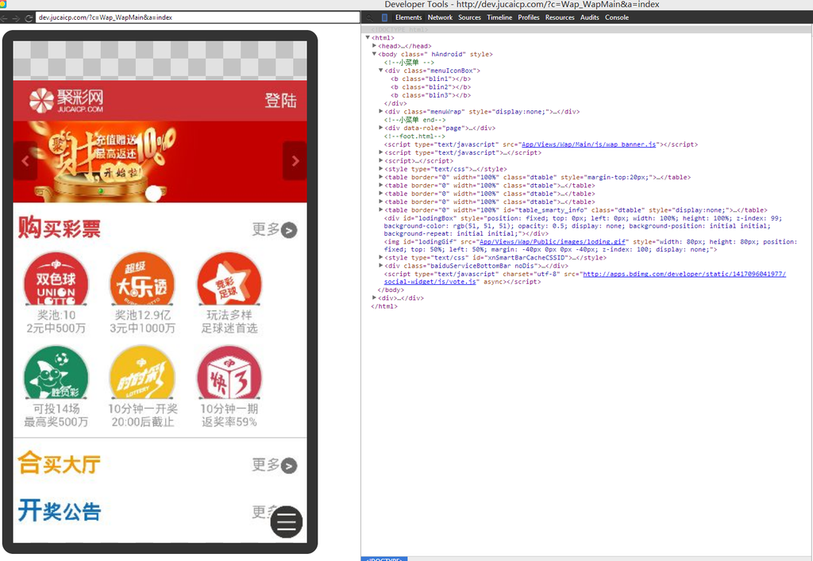
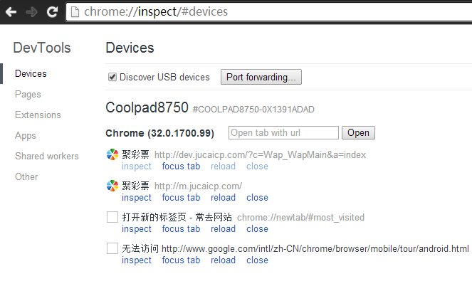

* content
{:toc}

最开始是使用Chrome DevTools 面板右侧拉伸快速查看效果； 
Firefox 响应式工具进一步调整（可以通过 Firefox 工具 -》Web 开发者 -》自适应设计视图 启用：）； 
Chrome Emulation 精细测试（打开 DevTools 之后，点击这个“手机图标”即可进入 Chrome 手机模拟器）。 
今天试了下通过调试Android上的Chrome，来查看效果，（iphone上还没试过，过几天换了手机在试试）。

1. 在Android设备上安装Chrome浏览器（版本>=32，经测试最新版40.0.2214.91无法使用，不清楚原因，换了低版本可用，附上迅雷下载链接[chrome](http://down.mz6.net/file/2013/12-25/com.android.chrome.apk))
2. 开启当前Android设备的USB调试
3. 在PC或MAC上安装chrome浏览器（版本>=32）和对应的Android设备驱动
4. 用USB线连接Android设备，在PC或MAC上的chrome地址栏输入 chrome://inspect 然后回车，或通过菜单图标→工具→检查设备，进入调试界面
5. 勾选界面中的 Discover USB devices ，直到搜索到你的Android设备
6. 在下面的页面列表（将展示已在Android上的chrome中打开的页面），点击对应的 inspect 开始调试，如下所示：

最后附上一个youtube视频链接：[youtube](https://www.youtube.com/watch?v=Q7rEFEMpwe4#t=45)